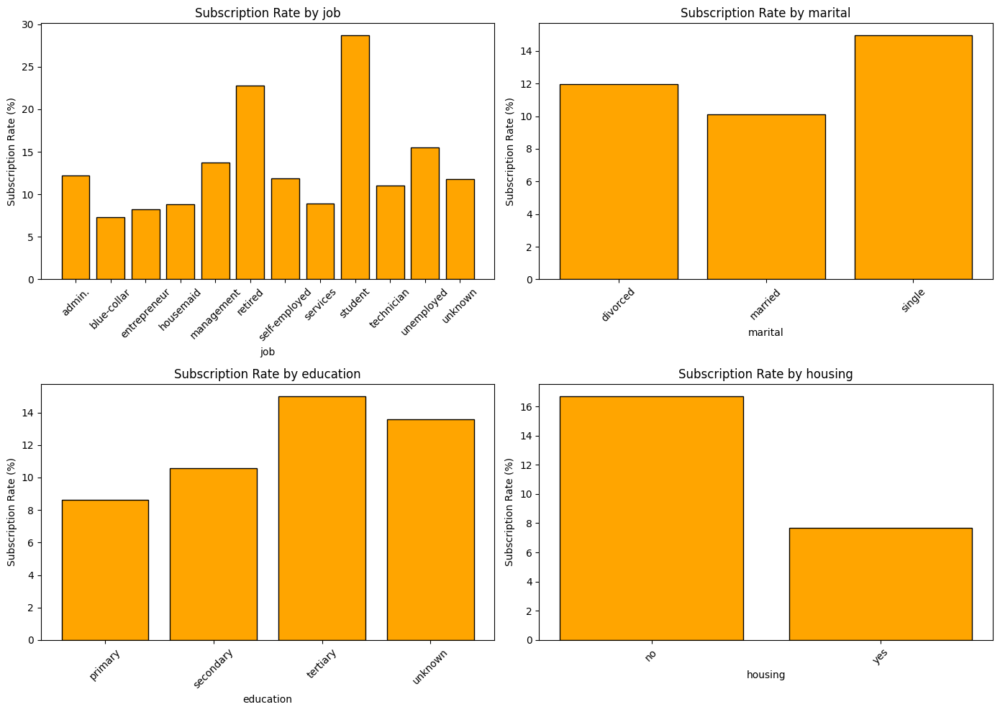
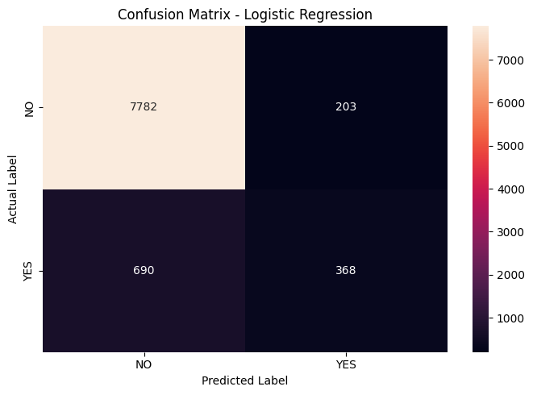
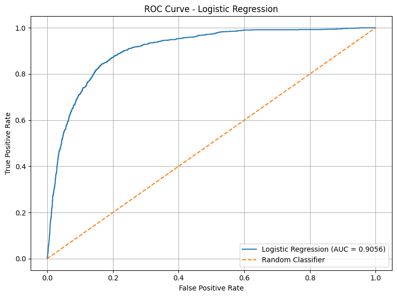

# Bank Marketing Term Deposit Prediction

## 1. Project Objective

The objective of this project is to develop a **Logistic Regression model** that predicts whether a bank customer will subscribe to a term deposit based on their demographic information, account details, and previous banking campaign interactions. The project uses the Bank Marketing dataset and follows a complete machine-learning workflow including dataset exploration, exploratory data analysis (EDA), preprocessing, model training, prediction, and evaluation.

---

## 2. Approach

The project follows an end-to-end supervised machine-learning workflow:

1. Load the Bank Marketing dataset.
2. Inspect the dataset structure, dimensions, columns, and data types.
3. Perform exploratory data analysis to understand customer characteristics and the target variable.
4. Check for missing values, duplicate records, and unknown categorical values.
5. Analyze the distribution of the target variable.
6. Separate the features and target variable.
7. Split the data into training and testing sets.
8. Standardize numerical features using `StandardScaler`.
9. Encode categorical features using `OneHotEncoder`.
10. Build a Logistic Regression classification pipeline.
11. Train the model using the training data.
12. Generate predictions and predicted probabilities for the test data.
13. Evaluate the model using Accuracy, Precision, Recall, F1 Score, ROC-AUC, Classification Report, Confusion Matrix, and ROC Curve.

---

## 3. Methodology

### 3.1 Dataset

The **Bank Marketing dataset** contains information about customers contacted during a bank marketing campaign. The objective is to predict whether a customer subscribed to a term deposit.

The target variable is `y`:

```text
no  → Customer did not subscribe
yes → Customer subscribed
```

The dataset includes customer and campaign-related attributes such as:

- `age`
- `job`
- `marital`
- `education`
- `default`
- `balance`
- `housing`
- `loan`
- `contact`
- `day`
- `month`
- `duration`
- `campaign`
- `pdays`
- `previous`
- `poutcome`

### 3.2 Exploratory Data Analysis

EDA was performed to understand the structure and characteristics of the dataset before training the model.

The analysis includes:

- Dataset shape and information.
- Data types.
- Descriptive statistics.
- Missing-value checks.
- Duplicate-value checks.
- Analysis of categorical variables.
- Target-variable distribution.
- Subscription-rate analysis across selected customer features.

### 3.3 Target Distribution

The target variable is imbalanced, with substantially more customers belonging to the `no` class than the `yes` class.



The **target distribution graph** shows the number of customers who did and did not subscribe to a term deposit. It helps identify class imbalance before training the classification model.

### 3.4 Data Preprocessing

The target variable `y` is separated from the input features.

The data is divided into training and testing sets. Numerical and categorical features are then processed separately.

**Numerical features:**
- Standardized using `StandardScaler`.

**Categorical features:**
- Converted into numerical form using `OneHotEncoder(handle_unknown="ignore")`.

The preprocessing step transforms the original mixed-type dataset into a numerical feature matrix that can be used by Logistic Regression.

The notebook reports:

```text
Processed training shape: (36168, 51)
Processed testing shape:  (9043, 51)
```

Therefore, the preprocessing produces **51 model-ready features**.

### 3.5 Logistic Regression

**Logistic Regression** is used because the target variable represents a binary classification problem.

The model is configured with:

```text
max_iter = 1000
random_state = 42
```

The preprocessing and classifier are combined into a single pipeline:

```text
Raw Data
   ↓
Train/Test Split
   ↓
ColumnTransformer
   ├── Numerical → StandardScaler
   └── Categorical → OneHotEncoder
   ↓
Logistic Regression
   ↓
Prediction
   ↓
NO / YES
```

The trained model produces both class predictions and subscription probabilities. The probabilities are used for ROC-AUC evaluation and the ROC curve.

---

## 4. Model Evaluation

The model is evaluated on the unseen test set using multiple performance metrics.

### 4.1 Test Set Results

```text
Test Set Results:
-----------------------------------
Accuracy    : 0.9012 (90.12%)
Precision   : 0.6445 (64.45%)
Recall      : 0.3478 (34.78%)
F1 Score    : 0.4518 (45.18%)
ROC-AUC     : 0.9056 (90.56%)
```

| Metric | Score | Percentage |
|---|---:|---:|
| Accuracy | 0.9012 | 90.12% |
| Precision | 0.6445 | 64.45% |
| Recall | 0.3478 | 34.78% |
| F1 Score | 0.4518 | 45.18% |
| ROC-AUC | 0.9056 | 90.56% |

### 4.2 Classification Report

The **classification report** summarizes the model's performance for both NO and YES classes using Precision, Recall, F1 Score, and Support.

```text
              precision    recall  f1-score   support

          NO     0.9186    0.9746    0.9457      7985
         YES     0.6445    0.3478    0.4518      1058

    accuracy                         0.9012      9043
   macro avg     0.7815    0.6612    0.6988      9043
weighted avg     0.8865    0.9012    0.8879      9043
```

The model performs considerably better on the majority `NO` class than on the `YES` class. The YES class has a recall of **34.78%**, indicating that many customers who actually subscribed were not identified correctly.

### 4.3 Confusion Matrix

```text
[[7782  203]
 [ 690  368]]
```



The **confusion matrix** shows the number of customers who were correctly and incorrectly classified as NO or YES. It shows 7,782 correctly classified NO customers and 368 correctly classified YES customers, while 203 NO customers were predicted as YES and 690 YES customers were predicted as NO.

### 4.4 ROC Curve



The **ROC curve** illustrates the model's ability to distinguish between customers who did and did not subscribe across different classification thresholds. The **AUC score of 0.9056** indicates strong overall class-separation ability.

---

## 5. Findings

The Logistic Regression model achieved an overall **accuracy of 90.12%** and a **ROC-AUC of 90.56%** on the test set.

However, accuracy alone does not fully describe the model's performance because the target variable is imbalanced. The model performs very well on the majority **NO** class, achieving a recall of **97.46%**, but the recall for the **YES** class is only **34.78%**.

The YES class has a **precision of 64.45%**, meaning that when the model predicts that a customer will subscribe, a reasonable proportion of those predictions are correct. However, the low recall shows that many actual subscribers are missed.

The **F1 Score of 45.18% for the YES class** reflects the difficulty of achieving a strong balance between Precision and Recall for the minority class.

Overall, the model provides a strong baseline for the bank marketing prediction task, but improving the identification of potential subscribers would be important for practical marketing use.

---

## 6. Limitations

- The target variable is significantly imbalanced.
- High accuracy is influenced by the large number of NO cases.
- Recall for the YES class is relatively low.
- Logistic Regression mainly captures linear relationships between the transformed features and the target.
- The dataset contains `unknown` categorical values that may represent missing or unavailable information.
- The model is evaluated using a single train-test split, so performance may vary with a different split.

---

## 7. Possible Improvements

The model can be further improved through the following approaches:

- **Class imbalance handling:** Apply class weighting or resampling techniques to improve detection of YES cases.
- **Threshold optimization:** Adjust the probability threshold to achieve a better balance between Precision and Recall.
- **Feature engineering:** Create additional meaningful features from customer and campaign information.
- **Hyperparameter tuning:** Experiment with Logistic Regression regularization and other parameters.
- **Alternative models:** Compare Logistic Regression with Decision Trees, Random Forest, Gradient Boosting, or other classification algorithms.
- **Cross-validation:** Use cross-validation to obtain a more robust estimate of model performance.
- **Handling unknown values:** Investigate whether `unknown` values should be treated as a separate category or handled as missing information.

---

## 8. Conclusion

This project developed a **Logistic Regression model** to predict whether bank customers would subscribe to a term deposit. The workflow included EDA, data-quality checks, target-distribution analysis, preprocessing of numerical and categorical variables, model training, prediction, and comprehensive evaluation.

The model achieved **90.12% accuracy** and a **90.56% ROC-AUC** on the test set. However, the **34.78% recall for the YES class** indicates that a significant number of actual subscribers are missed.

Therefore, although the Logistic Regression model provides a strong baseline, further improvements focused on class imbalance, threshold optimization, feature engineering, and alternative machine-learning models could improve its ability to identify potential subscribers.

---

## 9. How to Run

### 1. Open the Notebook

Open `Bank_Marketing(1).ipynb` using **Google Colab** or Jupyter Notebook.

### 2. Upload the Dataset

Place the Bank Marketing dataset in the location expected by the notebook.

The notebook uses the `bank-full.csv` dataset.

### 3. Run the Notebook

Run the notebook cells **in order from top to bottom**.

The notebook will perform:

- Dataset loading
- Dataset overview
- EDA
- Data-quality checks
- Target distribution analysis
- Feature analysis
- Train-test split
- Feature preprocessing
- Logistic Regression training
- Predictions
- Classification report
- Confusion matrix
- ROC curve
- Final evaluation metrics

### 4. View the Results

After execution, the notebook will display the EDA visualizations, processed-data information, classification report, confusion matrix, ROC curve, and final evaluation metrics.

---

## 10. Tools and Technologies Used

- Python
- Google Colab / Jupyter Notebook
- Pandas
- NumPy
- Matplotlib
- Seaborn
- Scikit-learn
- Logistic Regression
- StandardScaler
- OneHotEncoder
- ColumnTransformer
